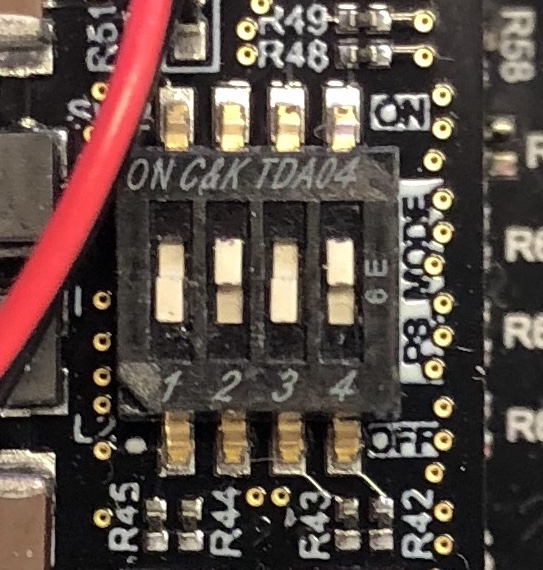
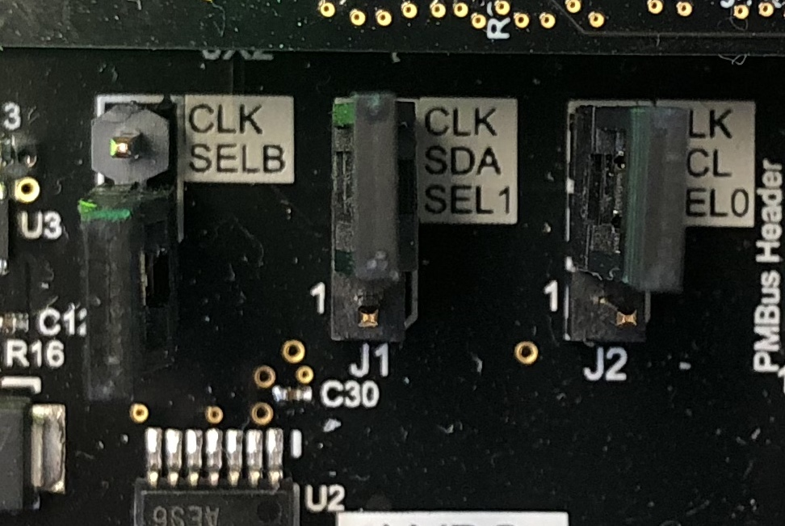
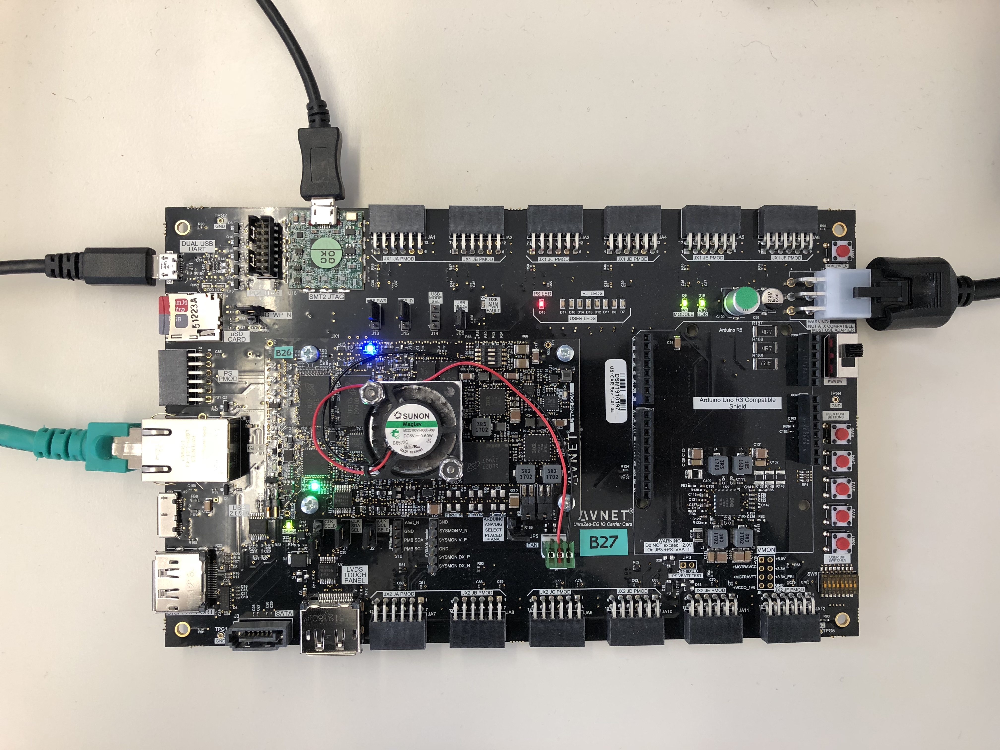

# Boot Linux on UltraZed-EG
This tutorial shows you how to boot Linux from a SD card on the UltraZed-EG IOCC board with usage of the PL (FPGA).

## Requirements
* Vivado 2017.2
* Petalinux 2017.2
* UltraZed-EG IOCC (xczu3eg-sfva625-1-i)

## Creating a new Vivado Project with an AXI4 IP
1. `source ${VIVADO_INSTALL_DIR}/settings64.sh`
2. Start Vivado with: `vivado`
3. Create a new project for the UltraZed-EG IOCC (xczu3eg-sfva625-1-i)
4. In the Project Manager -> Project Summary, under Settings make sure the Target language is set to Verilog.  If not, click on the language, and select Verilog from the Target language dropdown menu in the Settings window.  Click OK
5. Create a new AXI4 IP by going to _Tools -> Create and Package New IP..._
6. Click _Next >_
7. Choose _Create a new AXI4 Peripheral_ and click _Next >_
8. Choose a name (here: `axi_dummy`)
9. Click _Next >_
10. Keep the interfaces as they are and click _Next >_
11. Choose _Edit IP_ and click _Finish >_
12. In the _Sources_ view expand _axi\_dummy\_v1\_0_ and double click on _axi\_dummy\_v1\_0\_S00\_AXI\_inst ..._
13. Navigate to the following section in the verilog code:

    ```verilog
    // Implement memory mapped register select and read logic generation
    // Slave register read enable is asserted when valid address is available
    // and the slave is ready to accept the read address.
    assign slv_reg_rden = axi_arready & S_AXI_ARVALID & ~axi_rvalid;
    always @(*)
    begin
        // Address decoding for reading registers
        case ( axi_araddr[ADDR_LSB+OPT_MEM_ADDR_BITS:ADDR_LSB] )
            2'h0   : reg_data_out <= slv_reg0;
            2'h1   : reg_data_out <= slv_reg1;
            2'h2   : reg_data_out <= slv_reg2;
            2'h3   : reg_data_out <= slv_reg3;
            default : reg_data_out <= 0;
        endcase
    end
    ```
    
    and replace it with:

    ```verilog
    // Implement memory mapped register select and read logic generation
    // Slave register read enable is asserted when valid address is available
    // and the slave is ready to accept the read address.
    assign slv_reg_rden = axi_arready & S_AXI_ARVALID & ~axi_rvalid;
    always @(*)
    begin
        // Address decoding for reading registers
        case ( axi_araddr[ADDR_LSB+OPT_MEM_ADDR_BITS:ADDR_LSB] )
            2'h0   : reg_data_out <= slv_reg0;
            2'h1   : reg_data_out <= slv_reg0;
            2'h2   : reg_data_out <= slv_reg2;
            2'h3   : reg_data_out <= 32'hdeadbeef;
            default : reg_data_out <= 0;
        endcase
    end
    ```
    
14. Go to _Package IP -> Packaging Steps -> File Groups_
15. Click on _Merge changes from File Groups Wizard_
16. Click on _Package IP -> Packaging Steps -> Review and Package_
17. Click on _Re-Package IP_
18. Click on _Yes_
19. Go to _Flow Navigator -> Project Manager -> IP INTEGRATOR -> Create Block Design_
20. In the _Diagram_ window click right and choose _Add IP_
21. Search for _Zynq_ and double-click on _Zynq UltraScale+ MPSoC_
22. Above the _Diagram_ window clock on _Run Block Automation_
23. Click on _OK_
24. Double-click on the _Zynq UltraSCALE+_ in the _Diagram window_
25. Go to _Page Navigator -> I/O Configuration_
26. Unfold _High Speed_ in the _I/O Configuration_ window
27. Uncheck _Display Port_
28. Click on _OK_
29. In the _Diagram_ window click right and choose _Add IP_
30. Search for _axi dummy_ and double-click on _axi\_dummy\_v1.0_
31. Above the _Diagram_ window clock on _Run Block Automation_
32. Click on _OK_
33. Go to the _Sources_ tab and right-click on _design\_1 (design\_1.bd)_ and choose _Create HDL Wrapper_
34. Click on _OK_
35. Go to _Flow Navigator -> Project Manager -> PROGRAM AND DEBUG_ and click _Generate Bitstream_
36. Click on _OK_
37. When the synthesis, implementation and writing bitstream is completed click on _OK_
38. Go to _Files -> Export -> Export Hardware..._
39. Check _Include bitstream_ and click on _OK_
40. You may close Vivado now.

## Download the Board Support Package for the UltraZed IOCC
1. Go to: [http://ultrazed.org/support/design/17596/131](http://ultrazed.org/support/design/17596/131)
2. Download (login required) _UltraZed IO Carrier Card - PetaLinux 2017.2 Compressed BSP_
3. Unzip and copy to a desired location `cp uz3eg_iocc_2017_2.bsp ${BSPS}`

## Creating a new Petalinux Project
1. Open a Terminal with `bash` other shells may produce problems.
2. `source ${VIVADO_INSTALL_DIR}/settings64.sh`
3. `source ${PETALINUX_INSTALL_DIR}/settings.sh`
4. Navigate to the directory where you would like to create your Petalinux project: `cd ${PETALINUX_PARENT_DIR}`
5. Create a new Petalinux project with: `petalinux-create --type project --name ${PETALINUX_PROJECT_NAME} --source ${BSPS}/uz3eg_iocc_2017_2.bsp`
6. Go into the Petalinux project directory: `cd ${PETALINUX_PROJECT_PARENT}/${PETALINUX_PROJECT_NAME}` (`PETALINUX_PROJECT_ROOT=${PETALINUX_PROJECT_PARENT}/${PETALINUX_PROJECT_NAME}`)
7. Add the with Vivado generated hardware description file: `petalinux-config --get-hw-description ${VIVADO_PROJECT_ROOT}/${VIVADO_PROJECT_NAME}.sdk`
8. In the config menu do the following (Exit a submenu or the whole configuration menu with [Esc]-[Esc]):
    1. Go to _Subsystem AUTO Hardware Settings ---> Advanced bootable images storage Settings ---> boot image settings ---> image storage media --->_ select _primary sd_.
    2. Go to _Subsystem AUTO Hardware Settings ---> Advanced bootable images storage Settings ---> kernel image settings ---> image storage media --->_ select _primary sd_.
    3. Go to _Subsystem AUTO Hardware Settings ---> Advanced bootable images storage Settings ---> dtb image settings ---> image storage media --->_ select _primary sd_.
    4. Go to _Image Packaging Configuration ---> Root filesystem type --->_ select _SD card_
    5. Go to _Image Packaging Configuration ---> Device node of SD device --->_ type `/dev/mmcblk1p2`
9. Enable SSH server: `petalinux-config -c rootfs` go to _Filesystem Packages ---> console ---> network ---> dropbear_ select dropbear ([space]). Save and Exit.
10. Create an application to interface the AXI4 IP (axi\_dummy) on the PL.
    1. `petalinux-create --type apps --template c --name axidummy --enable` (caution: under line *\_* is not allowed in application names).
    2. Navigate to: `cd ${PETALINUX_PROJECT_ROOT}/project-spec/meta-user/recipes-apps/axidummy/files/`
    3. Add the following build rule to the `Makefile`:
  
    ```
    .PHONY clean:
    	-rm -f $(APP) *.elf *.gdb *.o
    ```
    
    4. Replace the code in `axidummy.c` with:
    
    ```c
    #include <stdio.h>
    #include <stdint.h>
    #include <stdlib.h>
    #include <fcntl.h>
    #include <sys/mman.h>
    
    #define AXI_BASE_ADDR 0x80000000
    
    #define SLV_REG0_OFFSET (0*4)
    #define SLV_REG1_OFFSET (1*4)
    #define SLV_REG2_OFFSET (2*4)
    #define SLV_REG3_OFFSET (3*4)
    
    #define MAP_SIZE 4096UL
    #define MAP_MASK (MAP_SIZE - 1)
    
    int main(int argc, char **argv)
    {
        printf("== START: AXI FPGA test ==\n");
    
        int memfd;
        void *mapped_base, *mapped_dev_base;
        off_t dev_base = AXI_BASE_ADDR;
     
        memfd = open("/dev/mem", O_RDWR | O_SYNC);
            if (memfd == -1) {
            printf("Can't open /dev/mem.\n");
            exit(0);
        }
    
        printf("/dev/mem opened.\n");
    
        // Map one page of memory into user space such that the device is in that page, but it may not
        // be at the start of the page.
        mapped_base = mmap(0, MAP_SIZE, PROT_READ | PROT_WRITE, MAP_SHARED, memfd, dev_base & ~MAP_MASK);
            if (mapped_base == (void *) -1) {
            printf("Can't map the memory to user space.\n");
            exit(0);
        }
        printf("Memory mapped at address %p.\n", mapped_base);
    
        // get the address of the device in user space which will be an offset from the base
        // that was mapped as memory is mapped at the start of a page
        mapped_dev_base = mapped_base + (dev_base & MAP_MASK);
    
        // write to slv_reg0
        *((volatile uint32_t *) (mapped_dev_base + SLV_REG0_OFFSET)) = 42;
        // write to slv_reg1
        *((volatile uint32_t *) (mapped_dev_base + SLV_REG1_OFFSET)) = 23;
        // write to slv_reg2
        *((volatile uint32_t *) (mapped_dev_base + SLV_REG2_OFFSET)) = 84;
        // write to slv_reg3
        *((volatile uint32_t *) (mapped_dev_base + SLV_REG3_OFFSET)) = 46;
    
    
        // read from slv_reg0
        printf("0x%08x\n", *((volatile uint32_t *) (mapped_dev_base + SLV_REG0_OFFSET)));
        // read from slv_reg1
        printf("0x%08x\n", *((volatile uint32_t *) (mapped_dev_base + SLV_REG1_OFFSET)));
        // read from slv_reg2
        printf("0x%08x\n", *((volatile uint32_t *) (mapped_dev_base + SLV_REG2_OFFSET)));
        // read from slv_reg3
        printf("0x%08x\n", *((volatile uint32_t *) (mapped_dev_base + SLV_REG3_OFFSET)));
    
    
        // unmap the memory before exiting
        if (munmap(mapped_base, MAP_SIZE) == -1) {
            printf("Can't unmap memory from user space.\n");
            exit(0);
        }
    
        close(memfd);
    
        printf("== STOP ==\n");
    
        return 0;
    }
    ```
    
    5. go back to project root: `cd ${PETALINUX_PROJECT_ROOT}`
  
11. Build project for the first time: `petalinux-build`
12. Package the project for the first time: `petalinux-package --boot --format BIN --fsbl images/linux/zynqmp_fsbl.elf --u-boot images/linux/u-boot.elf --fpga ${VIVADO_PROJECT_ROOT}/${VIVADO_PROJECT_NAME}.runs/impl_1/design_1_wrapper.bit --force`
13. Convert the bitstream `.bit` file into a `.bin` file.
    1. create the file `${PETALINUX_PROJECT_ROOT}/build/bootgen.own.bif` with the following content:
    
    ```
    the_ROM_image:
    {
    	[fsbl_config] a53_x64
    	[bootloader] ${PETALINUX_PROJECT_ROOT}/images/linux/zynqmp_fsbl.elf
    	[pmufw_image] ${PETALINUX_PROJECT_ROOT}/images/linux/pmufw.elf 
    	[destination_device=pl] ${VIVADO_PROJECT_ROOT}/${VIVADO_PROJECT_NAME}.runs/impl_1/design_1_wrapper.bit
    	[destination_cpu=a53-0, exception_level=el-3, trustzone] ${PETALINUX_PROJECT_ROOT}/images/linux/bl31.elf
    	[destination_cpu=a53-0, exception_level=el-2] ${PETALINUX_PROJECT_ROOT}/images/linux/u-boot.elf
    }
    ```
    2. Run from the `${PETALINUX_PROJECT_ROOT}` the following: `bootgen -image build/bootgen.own.bif -arch zynqmp -process_bitstream bin`
    3. This generates the `.bin` file at: `${VIVADO_PROJECT_ROOT}/${VIVADO_PROJECT_NAME}.runs/impl_1/design_1_wrapper.bit.bin`

14. Create an application to install the bitstream into the root filesystem.
    1. `petalinux-create --type apps --template install --name bitstream --enable`
    2. Remove the dummy file: `rm project-spec/meta-user/recipes-apps/bitstream/files/bitstream`
    3. Copy the bitstream `.bin` file into the application files: `cp ${VIVADO_PROJECT_ROOT}/${VIVADO_PROJECT_NAME}.runs/impl_1/design_1_wrapper.bit.bin project-spec/meta-user/recipes-apps/bitstream/files`
    4. Replace everything from `SRC_URI...` in `project-spec/meta-user/recipes-apps/bitstream/bitstream.bb` with:

    ```
    SRC_URI = "file://design_1_wrapper.bit.bin \
    	"
    FILES_${PN} += "/lib/*"
    
    S = "${WORKDIR}"
    
    do_install() {
    	    install -d ${D}/lib ${D}/lib/firmware
            install -m 0755 ${S}/design_1_wrapper.bit.bin ${D}/lib/firmware
    }
    ```

15. Edit the device tree file 
    1. open `project-spec/meta-user/recipes-bsp/device-tree/files/system-user.dtsi`
    2. Navigate to `&sdhci0` and `&sdhci1` and add `disable-wp;` to both sections:
    
    ```
    /* SD0 eMMC, 8-bit wide data bus */
    &sdhci0 {
    	status = "okay";
    	bus-width = <8>;
    	max-frequency = <50000000>;
        disable-wp;
    };
    
    /* SD1 with level shifter */
    &sdhci1 {
    	status = "okay";
    	max-frequency = <50000000>;
    	no-1-8-v;	/* for 1.0 silicon */
        disable-wp;
    };
    ``` 

16. Clean up the project: `petalinux-build -x distclean`
17. Build the project for a second time: `petalinux-build`
18. Package the project for a second time: `petalinux-package --boot --format BIN --fsbl images/linux/zynqmp_fsbl.elf --u-boot images/linux/u-boot.elf --fpga ${VIVADO_PROJECT_ROOT}/${VIVADO_PROJECT_NAME}.runs/impl_1/design_1_wrapper.bit --force`

## Format the SD card
1. Plug the SD card into your PC.
2. Find it with `sudo fdisk -l`
3. Unmount all partitions with `sudo umount /dev/sdXy`
4. Run `sudo fdisk /dev/sdX`
5. Press `d` to delete and [Enter] to delete all existing partitions
6. Press `p` to confirm that all partitions are gone. It should look like this:

    ```
    Disk /dev/sdX: 7948 MB, 7948206080 bytes, 15523840 sectors
    Units = sectors of 1 * 512 = 512 bytes
    Sector size (logical/physical): 512 bytes / 512 bytes
    I/O size (minimum/optimal): 512 bytes / 512 bytes
    Disk label type: dos
    Disk identifier: 0x00000000
    
       Device Boot      Start         End      Blocks   Id  System
    ```

7. Press `n` to create a new partition
8. Press `p` to make the new partition primary
9. Press [Enter] to accept the default (_1_)
10. Press [Enter] to accept the default (_2048_)
11. Type `+1G` to give the first partition a size of 1GB and press [Enter]
12. Press `n` to create a new partition
13. Press `p` to make the new partition primary
14. Press [Enter] to accept the default (_2_)
15. Press [Enter] to accept the default (_2099200_)
16. Press [Enter] to accept the default (depends on your SD card size)
17. Press `a` to make the first partition the boot partition
18. Type `1` to select the first partition as the boot partition and press [Enter]
19. Press `p` to print the new partition table. It should look like this:

    ```
    Disk /dev/sdX: 7948 MB, 7948206080 bytes, 15523840 sectors
    Units = sectors of 1 * 512 = 512 bytes
    Sector size (logical/physical): 512 bytes / 512 bytes
    I/O size (minimum/optimal): 512 bytes / 512 bytes
    Disk label type: dos
    Disk identifier: 0x00000000
    
       Device Boot      Start         End      Blocks   Id  System
    /dev/sdX1   *        2048     2099199     1048576   83  Linux
    /dev/sdX2         2099200    15523839     6712320   83  Linux
    ```
    
20. Press `w` to write the new partition table to the SD card
21. Format the first partition as FAT32 with: `sudo mkfs.vfat -F 32 -n boot /dev/sdX1`
22. Format the second partition as ext4 with: `sudo mkfs.ext4 -L root /dev/sdX2`

## Load Kernel and Root Filesystem onto SD card
1. Copy `BOOT.BIN`, `image.ub`, and `system.dtb` to _BOOT_ partition of SD card: `cp ${PETALINUX_PROJECT_ROOT}/images/linux/{BOOT.BIN,image.ub,system.dtb} ${BOOT_MOUNT_POINT}`
2. Copy `rootfs.cpio.gz` to _root_ partition of SD card: `sudo cp ${PETALINUX_PROJECT_ROOT}/images/linux/rootfs.cpio.gz ${ROOT_MOUNT_POINT}`
3. Go to _root_ partition of SD card: `cd ${ROOT_MOUNT_POINT}`
4. Unpack `rootfs.cpio.gz`: `sudo gunzip rootfs.cpio.gz` 
5. Unpack `rootfs.cpio`: `sudo pax -r -c -f rootfs.cpio` 
6. Unmount the _BOOT_ and _root_ partition of SD card.

## Boot the UltraZed-EG IOCC Board with SD card
1. Make sure the board is turned off.
2. Set the Ultrazed-EG into SD card boot _SW2[1:3]_ = OFF, ON, OFF, ON

    

3. Remove Jumper from _JP1_ and Put Jumper on _J1_ and _J2_ to 2 and 3

    

4. Connect _JTAG_ and _UART_ USB cables with your PC and the Board.
5. Connect an Ethernet cable with the board and your network.
6. Insert the SD card into the SD card slot.
7. Turn on the board.

    

8. Open a terminal and connect to the UART 1 with: `picocom /dev/ttyUSB1 -b 115200 -d 8 -y n -p 1`
9. Now you should see the boot console.
10. Login with user `root` and password `root`. (if installed the Ubuntu RootFS login with user: `zynqmp` and password: `zynqmp`)
11. After login type: `ifconfig` to get the IP of the board. The output should look like this:

    ```
    eth0      Link encap:Ethernet  HWaddr 00:0A:35:00:22:01  
              inet addr:${ULTARZED_IP}  Bcast:10.42.0.255  Mask:255.255.255.0
              inet6 addr: fe80::20a:35ff:fe00:2201%4879704/64 Scope:Link
              UP BROADCAST RUNNING MULTICAST  MTU:1500  Metric:1
              RX packets:3 errors:0 dropped:0 overruns:0 frame:0
              TX packets:13 errors:0 dropped:0 overruns:0 carrier:0
              collisions:0 txqueuelen:1000 
              RX bytes:702 (702.0 B)  TX bytes:1705 (1.6 KiB)
              Interrupt:30 
    ```
    
12. You can now connect via ssh from your PC with: `ssh -o UserKnownHostsFile=/dev/null -o StrictHostKeyChecking=no root@${ULTARZED_IP}`
13. You can copy files via ssh with: `scp -o UserKnownHostsFile=/dev/null -o StrictHostKeyChecking=no ${SOURCE_FILE} root@${ULTRAZED_IP}:${TARGET}`
14. To program the PL (FPGA) type: `echo design_1_wrapper.bit.bin > /sys/class/fpga_manager/fpga0/firmware`
15. Run `axidummy` from the UltraZed command line to verify that the FPGA design works.

## Updating the Hardware Description/PL Design
If you update the block design in Vivado and generate a new bitstream the following steps have to be done to update your Petalinux project:
1. Update the hardware defintion file in Petalinux: `petalinux-config --get-hw-description ${VIVADO_PROJECT_ROOT}/${VIVADO_PROJECT_NAME}.sdk`
2. Generate a new bitstream `.bin` file: `${PETALINUX_PROJECT_ROOT}` the following: `bootgen -image build/bootgen.own.bif -arch zynqmp -process_bitstream bin`
3. Copy the new bitstream `.bin` file into the application files: `cp ${VIVADO_PROJECT_ROOT}/${VIVADO_PROJECT_NAME}.runs/impl_1/design_1_wrapper.bit.bin project-spec/meta-user/recipes-apps/bitstream/files`
4. Clean up the project: `petalinux-build -x distclean` 
5. Build the project: `petalinux-build`
6. Package the project: `petalinux-package --boot --format BIN --fsbl images/linux/zynqmp_fsbl.elf --u-boot images/linux/u-boot.elf --fpga ${VIVADO_PROJECT_ROOT}/${VIVADO_PROJECT_NAME}.runs/impl_1/design_1_wrapper.bit --force`
7. Insert the SD card into your PC
8. Copy `BOOT.BIN`, `image.ub`, and `system.dtb` to _BOOT_ partition of SD card: `cp ${PETALINUX_PROJECT_ROOT}/images/linux/{BOOT.BIN,image.ub,system.dtb} ${BOOT_MOUNT_POINT}`
9. Copy `rootfs.cpio.gz` to _root_ partition of SD card: `sudo cp ${PETALINUX_PROJECT_ROOT}/images/linux/rootfs.cpio.gz ${ROOT_MOUNT_POINT}`
10. Unpack `rootfs.cpio.gz`: `sudo gunzip rootfs.cpio.gz` 
11. Unpack `rootfs.cpio`: `sudo pax -r -c -f rootfs.cpio` 
12. Unmount the _BOOT_ and _root_ partition of SD card.
13. Go to _Boot the UltraZed-EG IOCC Board with SD card_

## Install Ubuntu RootFS
Those steps were adopted from Tom Hoyt's `ultrazed_dev` repository: [https://github.com/twosixlabs/ultrazed_dev](https://github.com/twosixlabs/ultrazed_dev)
1. Download the Ubuntu 16.04 LTS Xenial Daily Build for ARM64 squashfs from [http://cdimage.ubuntu.com/ubuntu-server/xenial/daily/current/](http://cdimage.ubuntu.com/ubuntu-server/xenial/daily/current/) (`xenial-server-arm64.squashfs`)
2. Unpack the `xenial-server-arm64.squashfs` with:
```
mkdir ${ROOTFS_DIR}
sudo unsquashfs -f -d ${ROOTFS_DIR} ${DOWNLOADS_DIR}/xenial-server-arm64.squashfs
```
3. Add a user with sudo permissions:
    1. Edit `${ROOTFS_DIR}/etc/passwd` and add the following line:
    
        ```
        zynqmp:x:1337:1337:,,,:/home/zynqmp:/bin/bash
        ```
    
    2. Edit `${ROOTFS_DIR}/etc/shadow` and add the following line:
    
        ```
        zynqmp:$6$4YGUIFdh$z9VoX0koXXlnGGgkQgu4XlmVRwhB3rGVorCQ4nl.UHPtiRsJJ/4zjuRWOEdQ3q.CSr8eArdTEWMFSPrcwjE4G1:17504:0:99999:7:::
        ```
    
    3. Edit `${ROOTFS_DIR}/etc/gshadow` and add the following line:
    
        ```
        zynqmp:!::
        ```
    
    4. Edit `${ROOTFS_DIR}/etc/group` and add the following line:
    
        ```
        zynqmp:x:1337:
        ```
    
        and edit the the line `sudo:x:27:` to look like this:
    
        ``` 
        sudo:x:27:zynqmp
        ``` 
    
    5. Create a home directory for the user `zynqmp` with: `sudo mkdir ${ROOTFS_DIR}/home/zynqmp`
    
4. Edit `${ROOTFS_DIR}/etc/hostname` to look like this:

    ``` 
    ultrazed
    ```

5. Edit `${ROOTFS_DIR}/etc/hosts` to look like this:

    ``` 
    127.0.0.1	localhost
    127.0.1.1	ultrazed
    ``` 

6. Edit `${ROOTFS_DIR}/etc/apt/sources.list` to look like this:

    ```
    deb http://ports.ubuntu.com/ubuntu-ports/ xenial main
    deb http://ports.ubuntu.com/ubuntu-ports/ xenial universe
    deb http://ports.ubuntu.com/ubuntu-ports/ xenial multiverse
    deb http://ports.ubuntu.com/ubuntu-ports/ xenial-security main
    deb http://ports.ubuntu.com/ubuntu-ports/ xenial-updates main
    deb http://ports.ubuntu.com/ubuntu-ports/ xenial-updates universe
    deb http://ports.ubuntu.com/ubuntu-ports/ xenial-updates multiverse
    ```

7. Edit `${ROOTFS_DIR}/etc/fstab` to look like this:

    ```
    /dev/mmcblk1p2	/	auto	errors=remount-ro	0	1
    /dev/mmcblk1p1	/boot	auto	defaults		0	2
    ```

8. Insert the SD card into your PC
9. Copy `BOOT.BIN`, `image.ub`, and `system.dtb` to _BOOT_ partition of SD card: `cp ${PETALINUX_PROJECT_ROOT}/images/linux/{BOOT.BIN,image.ub,system.dtb} ${BOOT_MOUNT_POINT}`
10. Copy `rootfs.cpio.gz` to _root_ partition of SD card: `sudo cp ${PETALINUX_PROJECT_ROOT}/images/linux/rootfs.cpio.gz ${ROOT_MOUNT_POINT}`
11. Now instead of copying the Petalinux `rootfs.cpio` the Ubuntu RootFS will be copied to the _root_ part of the SD card: `sudo cp -a ${ROOTFS_DIR}/. ${ROOT_MOUNT_POINT}/`
12. Unmount the _BOOT_ and _root_ partition of SD card.
13. Go to _Boot the UltraZed-EG IOCC Board with SD card_

